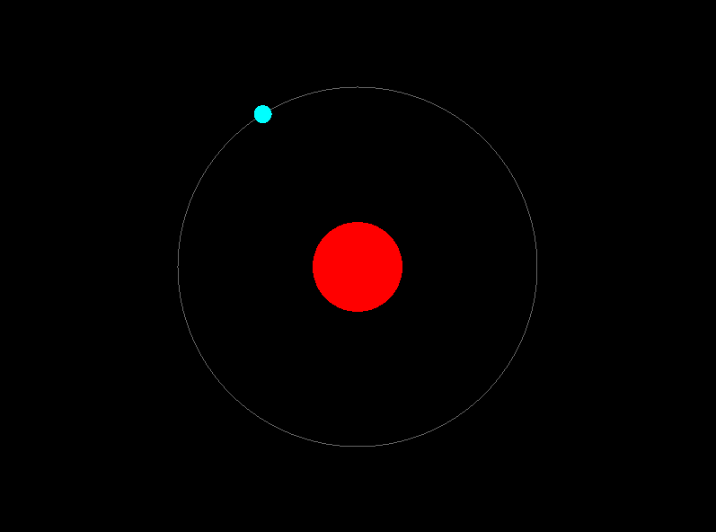
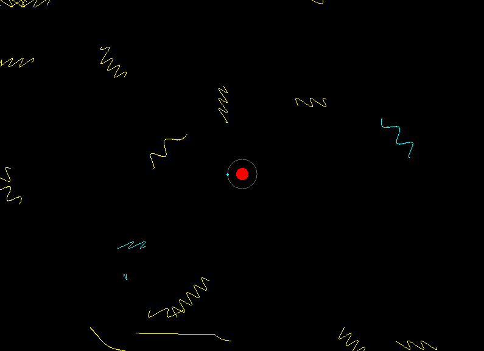

# Hydrogen Quantum Orbital Visualizer

An interactive simulation of hydrogen atom electron orbitals, built from first-principles quantum mechanics. Samples the exact Schrödinger wavefunction using CDF-inversion and renders the resulting probability clouds in real time via OpenGL point clouds or a brute-force GPU raytracer.

## Demos

<div align="center">

| Realtime 3D Model | 2D Bohr Model | Atom Excitation | GPU Raytracer |
| :---: | :---: | :---: | :---: |
|  |  |  |  |

</div>

## The Physics

### Quantum Numbers (n, l, m)

Every hydrogen orbital is uniquely described by three integers:

| Symbol | Name | Range | Physical meaning |
|--------|------|-------|------------------|
| $n$ | Principal | $n \ge 1$ | Energy level and shell size. Higher $n$ → larger, higher-energy orbital. |
| $l$ | Angular momentum | $0 \le l < n$ | Orbital **shape**: $l=0$ is *s* (spherical), $l=1$ is *p* (dumbbell), $l=2$ is *d* (cloverleaf), $l=3$ is *f*. |
| $m$ | Magnetic | $-l \le m \le l$ | **Orientation** of the orbital in space. |

**Example:** $n=3,\; l=2,\; m=1$ specifies a *3d* orbital with one particular spatial orientation out of the five possible $m \in \{-2,-1,0,1,2\}$.

### The Hydrogen Wavefunction

The full solution to the time-independent Schrödinger equation for hydrogen separates into radial and angular parts:

$$\psi_{nlm}(r,\theta,\varphi) \;=\; R_{nl}(r)\;\cdot\;Y_l^{\,m}(\theta,\varphi)$$

- **Radial part** $R_{nl}(r)$ — built from Associated Laguerre polynomials $L_{n-l-1}^{2l+1}$ and an exponential decay $e^{-r/(na_0)}$.
- **Angular part** $Y_l^{\,m}(\theta,\varphi)$ — the spherical harmonics, constructed from Associated Legendre polynomials $P_l^{|m|}(\cos\theta)$ and $e^{im\varphi}$.

The probability density of finding the electron at a given point in space is:

$$P(r,\theta,\varphi) \;=\; |\psi_{nlm}|^2 \, r^2 \sin\theta$$

This is what the simulation samples and renders — brighter regions correspond to higher $|\psi|^2$.

### Sampling Approach (CDF-Inversion)

We use **CDF-inversion sampling**, not rejection sampling or Metropolis–Hastings MCMC.

1. The radial PDF $P(r) \propto |R_{nl}(r)|^2\,r^2$ and polar PDF $P(\theta) \propto |Y_l^m(\theta,\varphi)|^2\,\sin\theta$ are discretised into fine bins.
2. A cumulative distribution function (CDF) is precomputed for each.
3. To draw a sample, we generate a uniform random $u \in [0,1]$ and binary-search (`std::lower_bound`) the CDF to invert it.
4. The azimuthal angle $\varphi$ is sampled uniformly in $[0, 2\pi)$ (real hydrogen orbitals have no $\varphi$ dependence in $|\psi|^2$ for a given $m$).

This approach is **exact** — every sample is independent, there is no burn-in period, no autocorrelation between samples, and no risk of the chain getting stuck in low-probability regions as with MCMC methods.

### Why the Raytracer Is Expensive

The raytracer renders each sampled point as a small lit sphere. For every pixel the fragment shader casts a ray and tests intersection against **every** sphere — yielding $O(\text{pixels} \times \text{spheres})$ intersection tests per frame.

At 100 000 spheres and an 800×600 viewport that is roughly **48 billion ray-sphere tests per frame**. There is no spatial acceleration structure (BVH, octree, grid) — the shader runs a brute-force loop. Expect low frame rates on all but the most powerful GPUs.

## Simulation Modes

The project includes five distinct visualisation modes, all accessible from the launcher:

1. **2D Bohr Model** — Classic 2D visualisation using fixed-radius circular orbits. A good starting point for understanding shell structure before moving to the full quantum picture.

2. **Realtime 3D** — Interactive OpenGL point-cloud of sampled orbital positions. Use keyboard controls to change quantum numbers ($n$, $l$, $m$) and particle count on the fly. Mouse drag orbits the camera; scroll zooms.

3. **Atom Excitation** — 2D simulation of an electron absorbing photon energy waves and jumping between energy levels. Demonstrates quantised energy transitions.

4. **Wave Atom 2D** — Wave-function visualisation showing standing-wave patterns along the orbital path. Illustrates the wave nature of the electron.

5. **Raytracer** — GPU-accelerated fragment-shader raytracer rendering each sample point as a lit sphere with Phong lighting.

   > ⚠️ **Warning:** Very GPU-intensive — no spatial acceleration structure. If the application freezes, reduce the particle count `N` in `src/atom_raytracer.cpp` and rebuild.

## Building

### Prerequisites

- C++17 compiler (GCC ≥ 9, Clang ≥ 10, or MSVC ≥ 19.14)
- CMake ≥ 3.10
- One of: **vcpkg** (recommended) or system packages
- OpenGL, GLFW3, GLEW, GLM

### Windows (vcpkg)

```bash
git clone https://github.com/toxicbishop/Atoms-Simulation.git
cd Atoms-Simulation
vcpkg install
cmake -B build -S . -DCMAKE_TOOLCHAIN_FILE=[vcpkg-root]/scripts/buildsystems/vcpkg.cmake
cmake --build build
```

### Linux (Debian/Ubuntu)

```bash
sudo apt update
sudo apt install build-essential cmake libglew-dev libglfw3-dev libglm-dev libgl1-mesa-dev
git clone https://github.com/toxicbishop/Atoms-Simulation.git
cd Atoms-Simulation
cmake -B build -S .
cmake --build build
```

Executables are output to `bin/`.

### Running

Run the **launcher** executable to get an interactive menu:

```bash
./bin/launcher        # Linux
.\bin\launcher.exe    # Windows
```

Select a mode by number (1–5). You can also run each simulation binary directly:

```bash
./bin/atom              # 2D Bohr model
./bin/atom_realtime     # Realtime 3D
./bin/atom_excitation   # Excitation simulation
./bin/wave_atom_2d      # Wave-function 2D
./bin/atom_raytracer    # GPU raytracer
```

## Controls

| Key | Action |
|-----|--------|
| **W / S** | Increase / decrease principal quantum number $n$ |
| **E / D** | Increase / decrease angular momentum quantum number $l$ |
| **R / F** | Increase / decrease magnetic quantum number $m$ |
| **T / G** | Increase / decrease particle count |
| **Mouse drag** | Orbit camera |
| **Scroll** | Zoom in / out |
| **Q** | Quit launcher |

## Project Structure

```
src/
├── orbital_math.h          Shared math: Laguerre, Legendre, CDF samplers
├── atom.cpp                2D Bohr model
├── atom_realtime.cpp       Realtime 3D visualisation
├── atom_raytracer.cpp      GPU raytracer
├── atom_excitation.cpp     Excitation simulation
├── wave_atom_2d.cpp        Wave-function 2D
└── launcher.cpp            Mode-selection launcher

tests/
└── test_orbital_math.cpp   Unit tests for orbital math

prototypes/
└── schrodinger.py          Early Python prototype (rejection sampling)
```

## Attribution

Originally based on [kavan010/Atoms](https://github.com/kavan010/Atoms). Extended with a shared math library (`orbital_math.h`), simulation-state encapsulation, CDF-inversion sampling, a GPU raytracer, unit tests, and a cross-platform CMake build system.

## License

MIT License — see [LICENSE](LICENSE) for details.